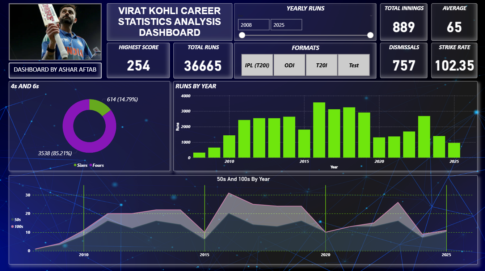

# Virat Kohli Career Statistics – Live Power BI Dashboard

## Dashboard Pic

## Overview
This project presents **Virat Kohli’s year-wise cricket performance** across all formats — **Test, ODI, T20I, and IPL** — in an **interactive Power BI dashboard**.  

The data is **kept live** through an automated pipeline that uses web scraping to update a Google Sheet, which is then connected to Power BI for real-time refresh.

---

## Features
- **Live Data Updates** Stats automatically refresh in the dashboard after new matches.
- **Multi-Format Coverage** Test, ODI, T20I, and IPL stats combined in one place.
- **Interactive Filters** Filter by format and year for customized analysis.
- **Yearly Trends** Visualizations showing performance progression over time.
- **Key KPIs** Runs, Average, Strike Rate, 50s, 100s, Boundaries, and more.

---

## Dashboard Insights
The Power BI report includes:
- **KPIs** Total Runs, Average, Strike Rate, Innings, Highest Score
- **Charts**:
  - Runs by Year
  - 4s vs 6s Distribution
  - 50s and 100s by Year
- **Interactive Filters** Format Selector & Year Slider

---

## How It Works
1. Data is collected from [Cricmetric](https://www.cricmetric.com) using a web scraping script.
2. The scraped data is sent to a Google Sheet.
3. Power BI connects to this Google Sheet to update the visuals automatically.

---

## What I Learned
- Designing an **insightful and visually appealing** Power BI dashboard.
- Structuring a project with clear folders and documentation for GitHub.
- Connecting Power BI to an **online data source** for real-time updates.
- Using web scraping tools to automate dataset refresh (with guidance).

---

## License
This project is licensed under the **MIT License** – free to use, modify, and share with attribution.

## Dataset Source

Click Here to Get Dataset: https://drive.google.com/file/d/1171wGgg0VooO8BFeYqueKu0AjzkBHksY/view?usp=sharing

Click Here to Get Spreadsheet:
https://docs.google.com/spreadsheets/d/1dtdcGA53rDzNFDfRMsD9_PWcE-lDcwrzVD5Hx8GR8dM/edit

## Let's Connect!

### Ashar Aftab 

Email: asharaftab2004@gmail.com

LinkedIn: www.linkedin.com/in/ashar-aftab-b09924295

---

> If you found this project useful or insightful, consider giving it a ⭐ on GitHub!

